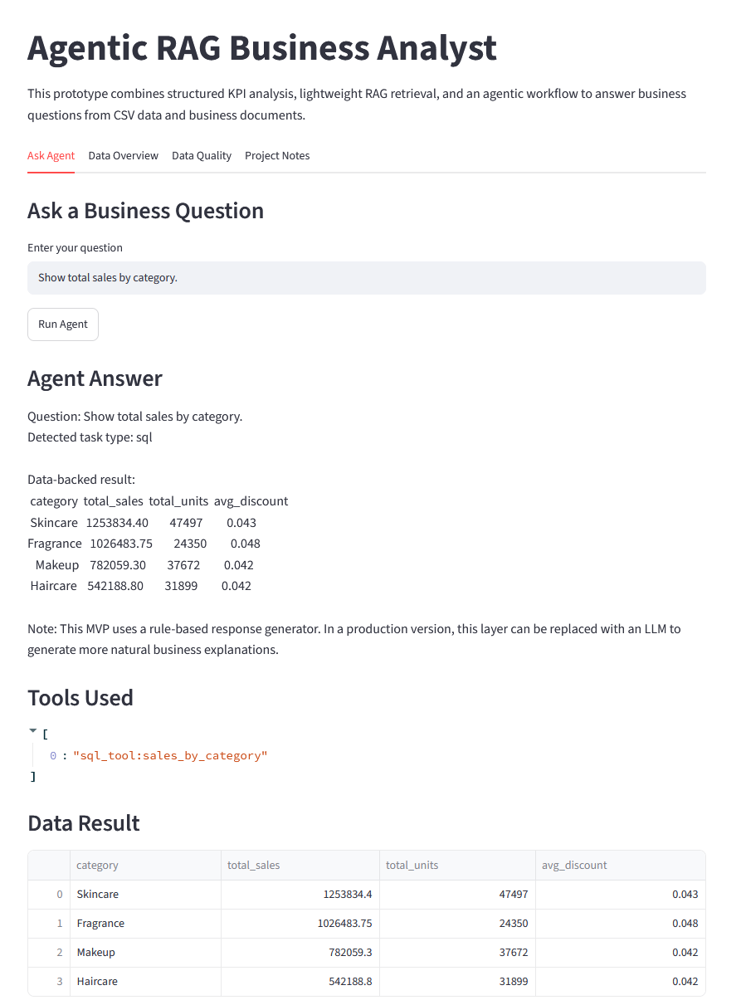
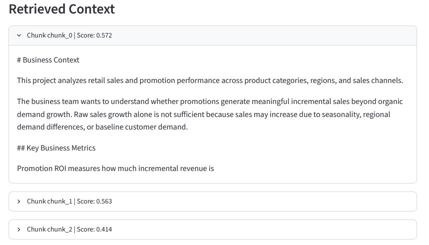
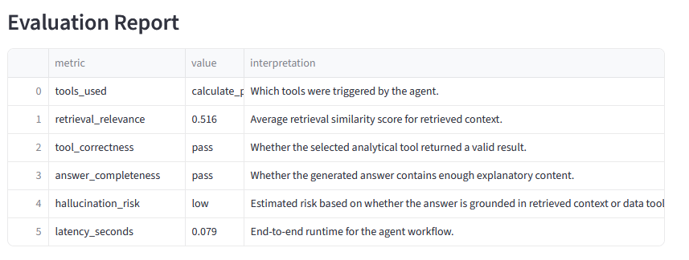
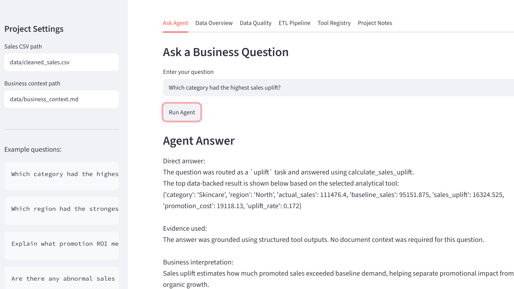
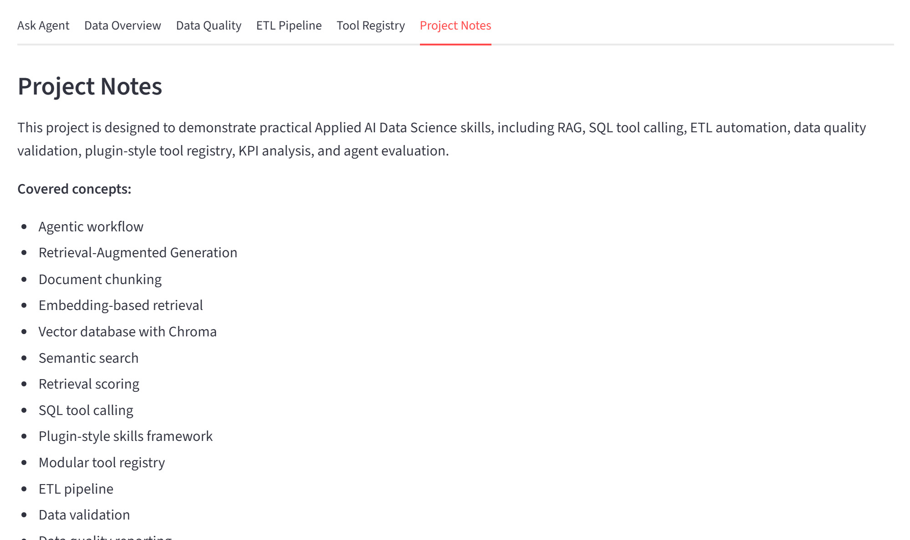

# Agentic RAG Business Analyst

## Overview

Agentic RAG Business Analyst is a modular Applied AI Data Science project that combines Retrieval-Augmented Generation, SQL tool calling, Python-based KPI analysis, ETL automation, plugin-style tool registry, grounded response generation, and automated agent evaluation.

The system answers natural language business questions by routing them across structured SQL tools, Python analytical tools, and embedding-based document retrieval. It prepares cleaned data through an automated ETL pipeline, loads downstream tables into SQLite, and evaluates agent behavior across predefined business test cases.

## Business Problem

Business teams often need to evaluate promotion performance, sales uplift, campaign ROI, category trends, and abnormal sales patterns. Raw sales data alone can be misleading because it may contain quality issues, inconsistent structures, and missing business context.

This project simulates an Applied AI workflow where raw sales data is cleaned through an ETL pipeline, connected to modular agent tools, and used by a RAG-based business analyst assistant to generate grounded business responses.

## Key Features

- RAG-based business question answering
- Embedding-based retrieval using SentenceTransformers and Chroma
- SQL tool calling over structured business data
- Python KPI tools for promotion ROI, sales uplift, category analysis, and anomaly detection
- Automated ETL pipeline for raw data validation, cleaning, transformation, and SQLite loading
- Data quality report covering schema checks, missing values, duplicates, validity checks, and outlier detection
- Plugin-style tool registry for modular SQL, KPI, retrieval, and evaluation tools
- Grounded response generation using retrieved context and structured tool outputs
- Automated agent evaluation across predefined business test cases
- Streamlit interface for interactive business analysis and evaluation monitoring

## ETL and Automation Pipeline

The project includes an automated ETL pipeline that prepares structured business data for downstream AI agent tools.

Pipeline steps:

```text
Raw sales CSV
  → schema validation
  → data quality checks
  → cleaning and type standardization
  → KPI-ready feature transformation
  → cleaned CSV export
  → SQLite database refresh
  → downstream SQL and KPI tools

## Screenshots

### SQL Tool Calling



### RAG Retrieval



### Evaluation Report



### Grounded Agent Response



### ETL Pipeline and Data Quality


### Automated Agent Evaluation


### Plugin-style Tool Registry


### Data Overview



## Tech Stack

- Python
- SQL / SQLite
- pandas
- Streamlit
- SentenceTransformers
- Chroma vector database
- scikit-learn
- Rule-based agent routing
- Controlled SQL tool calling

## Project Structure

```text
agentic-rag-business-analyst/
  app.py
  run_pipeline.py
  README.md
  requirements.txt

  data/
    sample_sales.csv
    cleaned_sales.csv
    business_context.md

  outputs/
    data_quality_report.csv
    agent_evaluation_report.csv

  src/
    __init__.py
    generate_sample_data.py
    data_loader.py
    etl_pipeline.py
    analysis_tools.py
    sql_tools.py
    tool_registry.py
    embedding_rag_pipeline.py
    response_generator.py
    llm_agent.py
    evaluation.py
    agent_evaluator.py

  screenshots/

## System Architecture

```text
Raw Sales Data
    ↓
ETL Pipeline
    ├── Schema Validation
    ├── Data Quality Checks
    ├── Cleaning
    └── KPI Feature Transformation
    ↓
Cleaned Data + SQLite Database
    ↓
Plugin-style Tool Registry
    ├── SQL Tools
    ├── KPI Analysis Tools
    ├── Retrieval Tools
    └── Evaluation Tools
    ↓
Agent Router
    ├── SQL Tool Calling
    ├── Python Analytical Tools
    └── RAG Retrieval
    ↓
Grounded Response Layer
    ↓
Automated Evaluation Report
    ↓
Streamlit App

```markdown
## How to Run

Create and activate a virtual environment:

```powershell
py -m venv .venv
.\.venv\Scripts\Activate.ps1

pip install -r requirements.txt

python src\generate_sample_data.py

python run_pipeline.py

streamlit run app.py


